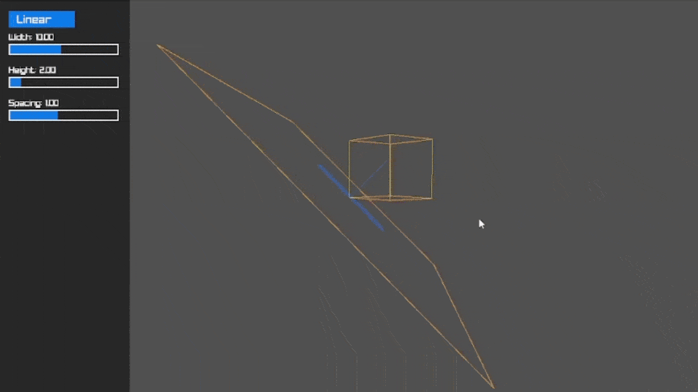
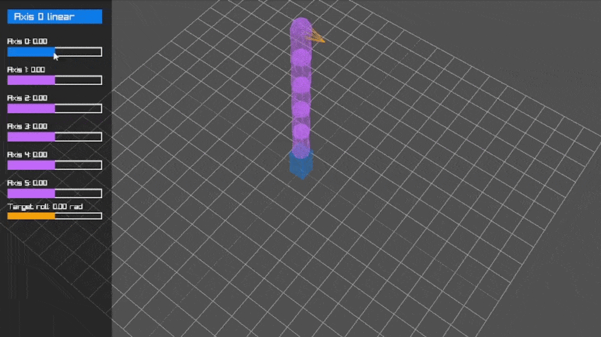

## ⚙️ Infos

This project is a technical test I was asked by a company as a part of their recruiting process.\
I did it over a weekend (to accelerate the recruiting process, so the code and logic is not perfect but still well beyond what was asked) and removed any elements I thought could lead to people to cheat using it.\
The .cpp files are now for 3D visualization, you can:
- download [CMake](https://cmake.org/download/),
- run those commands in a terminal,
```
mkdir build && cd build
cmake .. -DCMAKE_BUILD_TYPE=Release
cmake --build . --config Release
```
- run the toolpath and kinematic executables located at the indicated build paths to see the following results

# <p align="center">📏 Toolpath 🌀</p>

<p align="center">
    
</p>

## 🔍 About

3D printer ramp C++ implementation with Raylib visualization.

## 🎮 Usage

Click on the "Linear" toggle to switch back and forth between it and the "Spiral" kind.\
Drag the sliders to change their respective values.\
Drag on the scene to pan around X.

# <p align="center">🦾 Kinematic 🏁</p>

<p align="center">
    
</p>

## 🔍 About

Kinematic chain C++ implementation with Raylib serial manipulator visualization.

## 🎮 Usage

Click on the "Axis 0 linear" toggle to switch back and forth between it and the "rotary" kind.\
Drag the sliders to change their respective values.\
Drag on the scene to pan around and scroll the mouse wheel to zoom/unzoom.