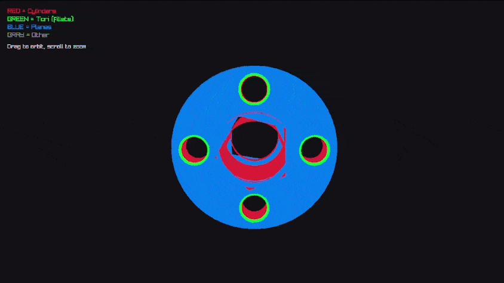

# <p align="center">💻 Simulations 🧊</p>

This project started off a weekend technical test I was asked by a company as part of their recruiting process (removed any elements I thought could lead people to cheat using it).\
Since I used [raylib](https://www.raylib.com/) and [eigen](https://gitlab.com/libeigen/eigen) for visualization, which are solid C++ choices for other projects I had in mind, I decided to continue from their existing setup:
- download [CMake 4.0+](https://cmake.org/download/)
- then either
    - run those commands in a terminal,
    ```
    mkdir build && cd build
    cmake ..
    cmake --build .
    ```
    - run the executables located at the indicated build paths
- or, if you're on [VSCode](https://code.visualstudio.com/) like me, for a more UI approach
    - install the [Cmake Tools](https://marketplace.visualstudio.com/items?itemName=ms-vscode.cmake-tools) extension
    - Search "CMake: Set Launch/Debug Target" in the command palette and select the target you want
    - Click on the bottom left ▶️ button

Available targets:

# <p align="center">📏 Toolpath 🌀</p>

<p align="center">
    <a href="https://en.wiktionary.org/wiki/toolpath">
        
    </a>
</p>

[3D printer](https://en.wikipedia.org/wiki/3D_printing) ramp generation.

Click on the "Linear" toggle to switch back and forth between it and the "Spiral" kind.\
Drag the sliders to change their respective values.\
Drag on the scene to pan around X.

# <p align="center">🦾 Kinematic 🏁</p>

<p align="center">
    <a href="https://en.wikipedia.org/wiki/Kinematics">
        
    </a>
</p>

[Kinematic chain](https://en.wikipedia.org/wiki/Kinematic_chain) with [serial manipulator](https://en.wikipedia.org/wiki/Serial_manipulator).

Click on the "Axis 0 linear" toggle to switch back and forth between it and the "rotary" kind (not possible on the other axes since it'd break the arm).\
Drag the sliders to change their respective values.\
Drag on the scene to pan around and scroll the mouse wheel to zoom/unzoom.

# <p align="center">🍲 Soup 🦠</p>

<p align="center">
    <a href="https://en.wikipedia.org/wiki/Primordial_soup">
        
    </a>
</p>

[Artificial life](https://en.wikipedia.org/wiki/Artificial_life) [particle method](https://en.wikipedia.org/wiki/Particle_method) [N-body simulation](https://en.wikipedia.org/wiki/N-body_simulation) exploring [emergent behavior](https://en.wikipedia.org/wiki/Emergence) inspired by the [primordial soup](https://en.wikipedia.org/wiki/Primordial_soup).

# <p align="center">🔺 CAD 🧊</p>

<p align="center">
    <a href="https://en.wikipedia.org/wiki/Computer-aided_design">
        
    </a>
</p>

Minimal [STEP](https://en.wikipedia.org/wiki/ISO_10303) file loader (cylinders, planes and tori with their relevant keywords for rendering, everything else (styling, metadata, presentation, assembly) is ignored) and [tessellator](https://en.wikipedia.org/wiki/Tessellation_(computer_graphics)) for [B-rep](https://en.wikipedia.org/wiki/Boundary_representation) to [mesh](https://en.wikipedia.org/wiki/Polygon_mesh) visualization.\
Drag on the scene to pan around and scroll the mouse wheel to zoom/unzoom.

# <p align="center">📟 PPI ᯤ</p>

<p align="center">
    <a href="https://en.wikipedia.org/wiki/Plan_position_indicator">
        
    </a>
</p>

Real-time PPI [sonar](https://en.wikipedia.org/wiki/Sonar) display simulating active and passive detection modes, two-way [transmission loss](https://en.wikipedia.org/wiki/Transmission_loss), [thermocline](https://en.wikipedia.org/wiki/Thermocline)-induced shadow zones, and a depth-varying [sound speed profile](https://en.wikipedia.org/wiki/Sound_speed_profile).\
Assumes we're a surface vessel with sonar [transducer](https://en.wikipedia.org/wiki/Transducer) pointing downward towards submarines/whales/etc...\
Click on the "Active" toggle to switch back and forth between it and the "Passive" mode.\
Drag the sliders to change their respective values.