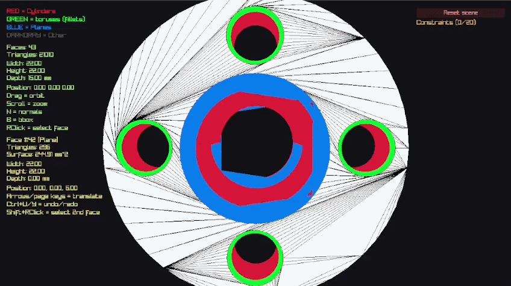
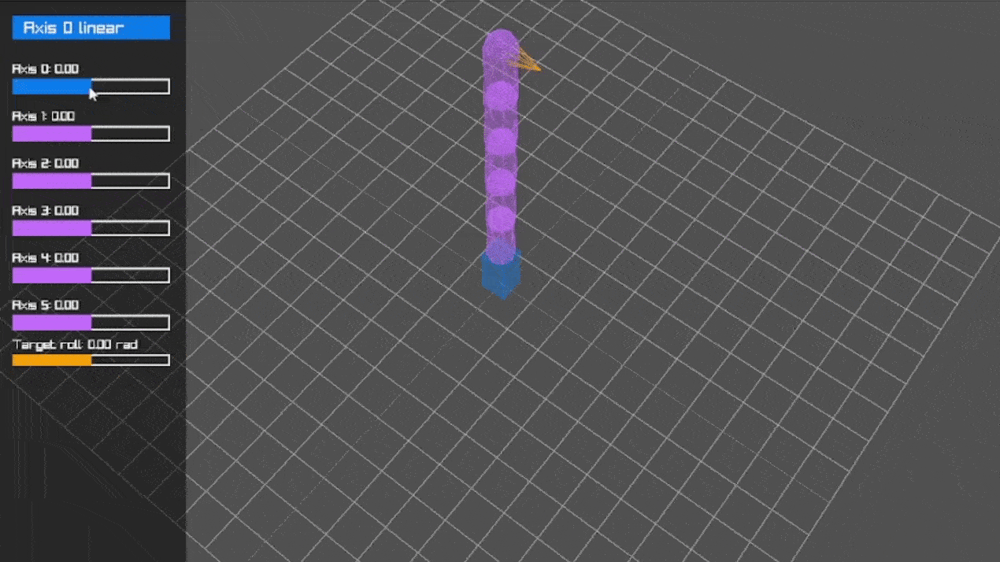
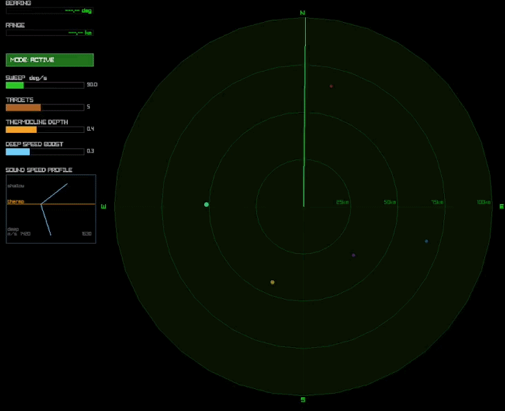
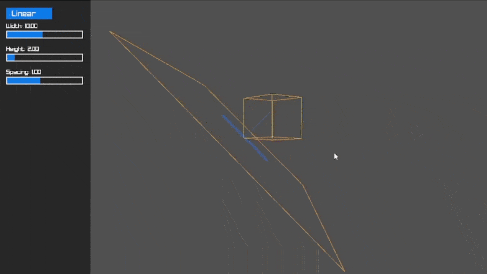

# <p align="center">💻 Simulations 🧊</p>

This project started off a weekend technical test I was asked by a company as part of their recruiting process (removed any elements I thought could lead people to cheat using it).\
The code intentionally has a high amount of comments (with analogies and examples for hard concepts) as this was made for educational purposes.\
Since I used [raylib](https://www.raylib.com/) and [eigen](https://gitlab.com/libeigen/eigen) for visualization, which are solid C++ choices for other projects I had in mind, I decided to continue from their existing setup:
- download [CMake 4.0+](https://cmake.org/download/)
- then either
    - run those commands in a terminal,
    ```
    mkdir build && cd build
    cmake ..
    cmake --build .
    ```
    - run the executables located at the indicated build paths
- or, if you're on [VSCode](https://code.visualstudio.com/) like me, for a more UI approach
    - install the [Cmake Tools](https://marketplace.visualstudio.com/items?itemName=ms-vscode.cmake-tools) extension
    - Search "CMake: Set Launch/Debug Target" in the command palette and select the target you want
    - Click on the bottom left ▶️ button

Available targets:

# <p align="center">🔺 CAD 🧊</p>

<p align="center">
    <a href="https://en.wikipedia.org/wiki/Computer-aided_design">
        
    </a>
</p>

Minimal [STEP](https://en.wikipedia.org/wiki/ISO_10303) file loader (cylinders, planes and toruses with their relevant keywords for rendering, everything else (styling, metadata, presentation, [assembly](https://en.wikipedia.org/wiki/Assembly_modelling)) is ignored) and [tessellator](https://en.wikipedia.org/wiki/Tessellation_(computer_graphics)) for [B-rep](https://en.wikipedia.org/wiki/Boundary_representation) to [mesh](https://en.wikipedia.org/wiki/Polygon_mesh) visualization.

<p align="center">
    <a href="https://en.wikipedia.org/wiki/Comparison_of_computer-aided_design_software">
        
    </a>
</p>

Completed by:
- convenient controls and measurements in the UI,
- [face selection](https://en.wikipedia.org/wiki/Ray_casting) for 3D [translation](https://en.wikipedia.org/wiki/Translation_(geometry)) involving rudimentary plane-cylinder [geometry healing](https://en.wikipedia.org/wiki/Mesh_generation), as well as [undo/redo](https://en.wikipedia.org/wiki/Undo),
- 2nd face selection for their [centroid-centroid](https://en.wikipedia.org/wiki/Centroid) distance and distance/symmetry translation [constraints](https://en.wikipedia.org/wiki/Constraint_(computer-aided_design)) (chain constraints supported).

# <p align="center">🦾 Kinematic 🏁</p>

<p align="center">
    <a href="https://en.wikipedia.org/wiki/Kinematics">
        
    </a>
</p>

[Kinematic chain](https://en.wikipedia.org/wiki/Kinematic_chain) of a [serial manipulator](https://en.wikipedia.org/wiki/Serial_manipulator).\
Only axis 0 (base) can be changed between linear and rotary because linear on any other piece would break the arm.

# <p align="center">📟 PPI ᯤ</p>

<p align="center">
    <a href="https://en.wikipedia.org/wiki/Plan_position_indicator">
        
    </a>
</p>

Real-time PPI [sonar](https://en.wikipedia.org/wiki/Sonar) display simulating active (send then receive, gets range but less stealthy) and passive (only receive, gets only direction but more stealthy) detection modes, two-way [transmission loss](https://en.wikipedia.org/wiki/Transmission_loss), [thermocline](https://en.wikipedia.org/wiki/Thermocline)-induced shadow zones, and a depth-varying [sound speed profile](https://en.wikipedia.org/wiki/Sound_speed_profile).\
Assumes we're a surface vessel with sonar [transducer](https://en.wikipedia.org/wiki/Transducer) pointing downward towards submarines/whales/etc...

# <p align="center">📏 Toolpath 🌀</p>

<p align="center">
    <a href="https://en.wiktionary.org/wiki/toolpath">
        
    </a>
</p>

[3D printing](https://en.wikipedia.org/wiki/3D_printing) base generation (for a shape/position that couldn't be printed if not for it).

# <p align="center">🍲 Soup 🦠</p>

<p align="center">
    <a href="https://en.wikipedia.org/wiki/Primordial_soup">
        
    </a>
</p>

[Artificial life](https://en.wikipedia.org/wiki/Artificial_life) [particle method](https://en.wikipedia.org/wiki/Particle_method) [N-body simulation](https://en.wikipedia.org/wiki/N-body_simulation) exploring [emergent behavior](https://en.wikipedia.org/wiki/Emergence) inspired by the [primordial soup](https://en.wikipedia.org/wiki/Primordial_soup).